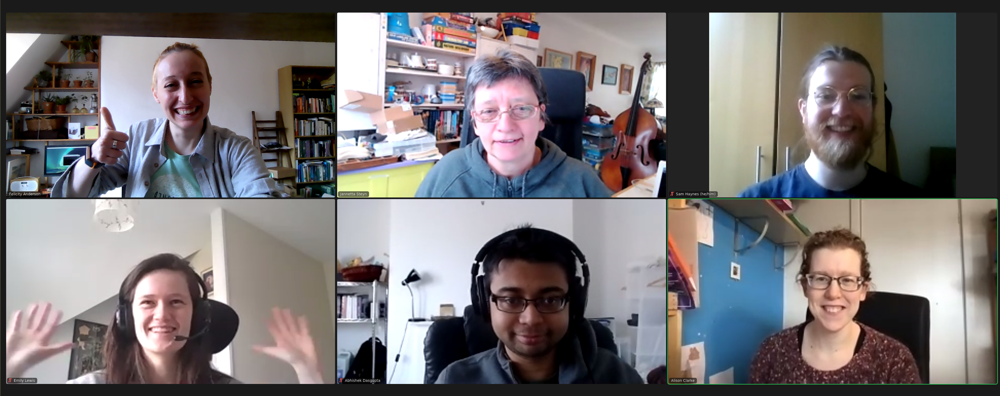

Carpentries Offline was born out of the Software Sustainability Institute's [2021 Collababorations Workshop](https://www.software.ac.uk/cw21?_ga=2.230971867.593926244.1617037201-1031762173.1614775769). The idea was formed by a **[team](originalteam)** during the Collaborative Ideas session, and the implementation began on the Hack Day. Our aim was to find a solution to the challenges presented when trying to run workshops with limited or no Internet access.

<h2>The SSI CW 2021 HackDay Team</h2>

Our HackDay team. Very proud of ourselves for winning the HackDay with CarpenPi:

<table style="width:600px; text-align:center;border: 1px solid black">
<tr>
  <td>Flic Anderson</td><td>Jannetta Steyn</td><td>Sam Haynes</td>
</tr><tr>
  <td>Emily Lewis</td><td>Abhishek Dasgupta</td><td>Alison Clarke</td>
</tr>
</table>

