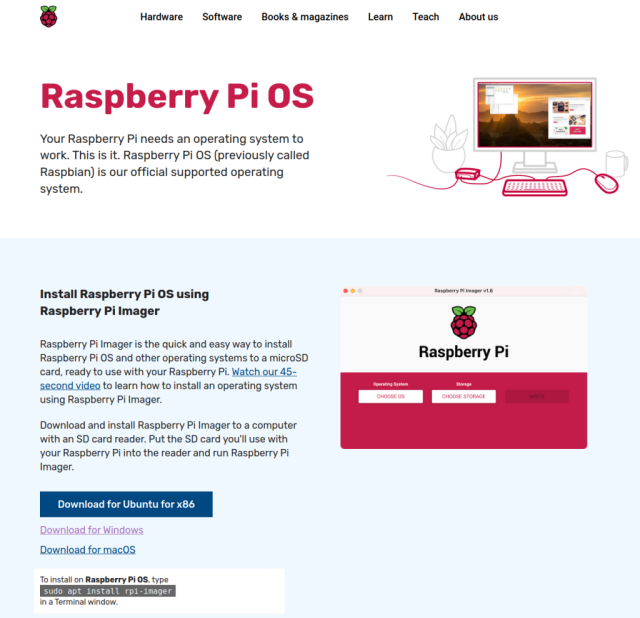

# Setting up a Raspberry Pi

There are loads of tutorials all over the web for setting up a Raspberry Pi (RPi) computer. But, to keep everything in one central place for this project, we will describe the setup procedure here.

## Introduction

As a server a computer usually does not need a screen, keyboard or mouse attached to it. A screen and a keyboard are attached to set the server up but once that is done and the computer connects to the network, it can be accessed remotely. For this reason a server does not need to have a Graphic User Interface (GUI) installed. You will never run applications such as a web browser or a spreadsheet application on a server so there is no need for a GUI. The server will provide a text based terminal where commands can be entered to do any system administration.

To this end, the RPi Foundation makes to versions of the RPi Operating System (OS) available:
- Raspberry Pi OS Lite
- Raspberry Pi OS Full

The Lite version has no GUI and no desktop environment while the Full version has a desktop environment and recommended applications.

The RPi Foundation has now made it really easy to get a Pi computer up and running. The first thing to do is to is to create a Micro SD Card with the operating system on it. Using your desktop computer or laptop download the RPi Imager from this website: [https://www.raspberrypi.org/software/](https://www.raspberrypi.org/software/). Chances are that when you land on the website the download link for the operating system, of your computer, will be highlighted, eg. 

Click on the link and save the installer to your local computer. Install and run the RPi Imager.

## Rasbperry Pi as a Server

## Raspberry Pi as a Desktop Computer
