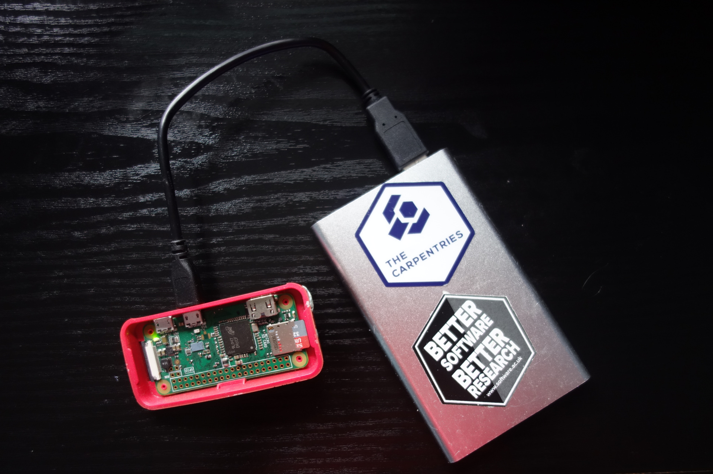
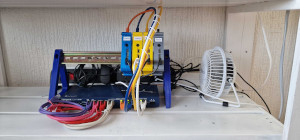

*(If you would like to fix something or contribute, please make your way to our GitHub repositories at [https://github.com/carpentriesoffline/](https://github.com/carpentriesoffline/)).*

CarpentriesOffline aims to provide a solution for running Software, Data, Library and HPC Carpentries workshop in areas where there is limited or no Internet access.

Several people have also pointed out that an offline solution could serve more than just folks in Internet challenged areas. Sometimes, it would be useful not to have to rely on Internet access to avoid any problems during a workshop. So there is scope for this project to serve a much wider community that originally anticipated.

We started the project by creating a software image that can be written to an SD card for use in a Raspberry Pi (RPi) computer, to turn it into an access point and a server. However, for the past few years RPis have become very difficult to source. We also learnt that there are certain limits when using RPis and so we decided to look into alternative solutions. 

We would not want to see the RPi idea go to waste as we still believe it will provide an excellent solution. But to provide an alternative we have thought it well to start work on creating a bootable USB stick with a version of Linux and all the previously mentioned content and services. Learners and instructors usually have their own laptops when they attend a workshop. The USB stick can then be used to turn the instructors laptop into an access point and web server.

There are now three threads of development for CarpentriesOffline, 1) The Raspberry Pi SD card image, 2) The bootable flashdrive and 3) a mini HPC.

	

		

			Raspberry Pi SD card image
		

		

			
		

	

	

		

			Bootable Flash Drive
		

		

			
		

	

	

		

			<a href="miniHPC">mini HPC</a>
		

		

			
		

	

