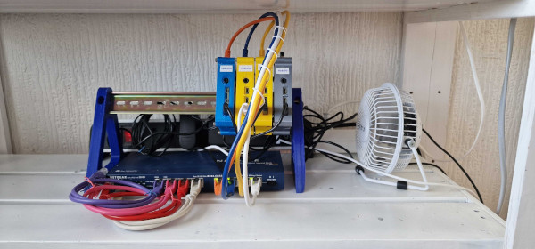

Meet Pixie. Our first prototype.

<h2>What?</h2>


**See our [updated version](miniHPC_update).**
 

Pixie is our prototype High Performance Computer (HPC), built with:

<ul>
	<li>Raspberry Pi (RPi) 4 2GB single board computers (SBC).</li>
	<li>An 8 port Netgear switch</li>
	<li>A 128GB flash drive for shared storage</li>
	<li>A 32GB SD card to boot the main node from</li>
	<li>A very expensive, highly specilized cooling device to keep it all cool. (Oh, okay then, it's a USB desktop fan)</li>
	<li>Loads of power supplies</li>
	<li>Loads of 10BaseT Cat6 ethernet cables</li>
	<li>3D printed DIN Rail stand</li>
	<li>3D printed RPi cases</li>
	<li>Strip plug</li>
</ul>

<h2>Why?</h2>
There are two parts to the why. 1) Why RPis when we have already mentioned that they are almost impossible to get hold of and 2) why a mini HPC?

<h3>Why Pi?</h3>
Because RPis are nowhere to be found, the decision was made to buy Rock 4SE SBCs. The problems is that these boards are only available at two companies in the UK, RS and OKdo, and OKdo is a subsidiary of RS. We noticed that they have discounts available for education so we started an enquiry into the possibility of getting these discounts. Unfortunately this is where the wheels came off. It took three weeks before we could eventually place an order and when the last batch of items, the PoE hats, arrived, they didn't fit the Rock 4 boards. While this was going on, to not waste time, we started putting together a mini-HPC using Raspberry Pis that we already own.

<h3>Why a mini HPC?</h3>
Many people have built Raspberry Pi HPCs, why do we want to include this as part of the CarpentriesOffline project? The need for this project became apparent in February 2023 when we ran a workshop for the N8 at Newcastle University using the Carpentries Incubator lesson, Introduction to High-Performance Computing. There are a few things that seem to, almost always, go wrong when running a workshop such as this one:

<ol>
	<li>People do not register for HPC accounts before the workshop. Most HPCs will have certain hoops you need to jump through when you want to obtain a user account on them. There are often time delays to get the accounts approved which means that if the learners did not obtain their logins before the workshop they are not guaranteed to get a login arranged on the day of the workshop.</li>
	<li>Login nodes can experience problems due to users running processes on them that they are not supposed to. When this happens others users cannot log in. Obviously, workshop have to happen within a certain time frame and if the learners can get logged in, the workshop can't continue.</li>
	<li>The length of queues and the load on an HPC cannot be controlled and if it so happens that many other users are accessing the HPC on the day of the workshop, access can be slow and jobs in the queue might not get completed in a timely manner for the workshop.</li>
	<li>Last but not the least are problems with The Internet itself.</li>
</ol>

HPCs are not easy to set up. Many document their processes but it still requires quite a lot of expertise to set up. What we would like to do is to create images of the SD cards required to boot the RPis and/or Rock Pis straight into an HPC. Instructors should be able to obtain specified hardware and know how to connect everything, write the OS image to an SD card or SSD and boot the computer into a usable HPC state.

<a href="current_unknowns_and_testing">Current Unknowns and Testing</a>

 
 
