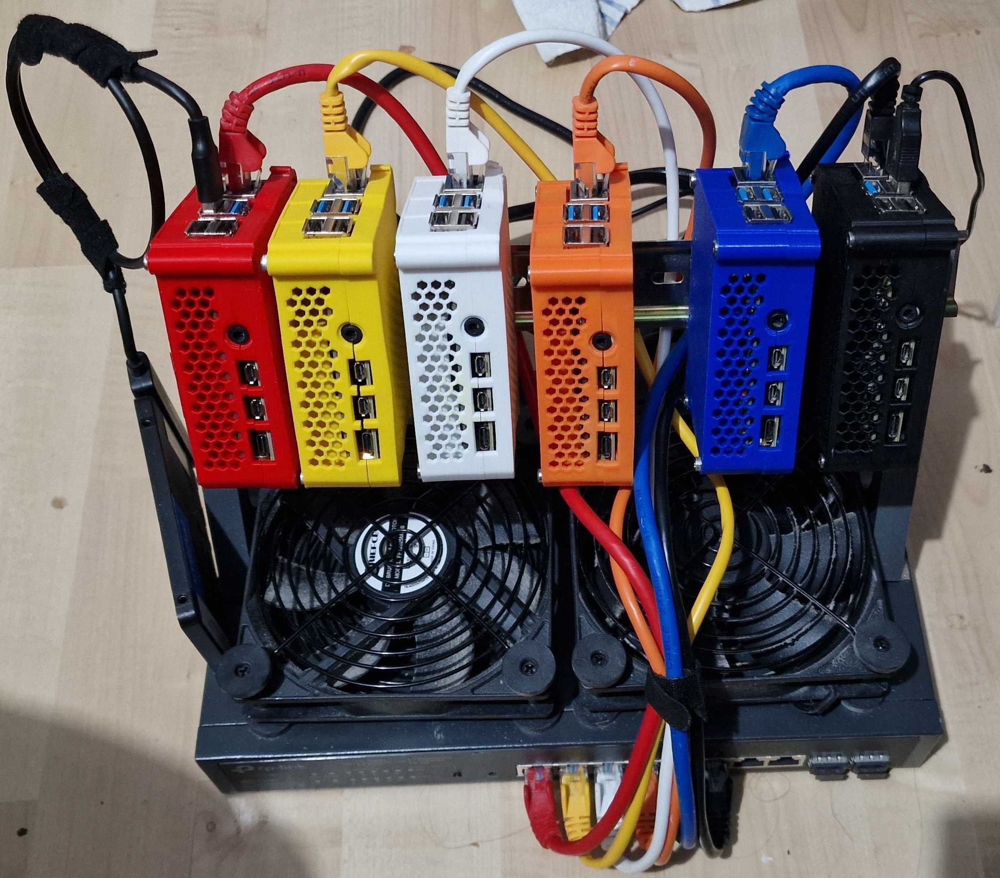

Since starting this project a couple of years ago, some work has gone into Pixie (our miniHPC).

Updated Pixie.

We are now up to five compute nodes and a login node. 

# Current hardware configuration:

1. 6 x Raspberry Pi 4 with 4GB
1. 6 x PoE hats
1. 1TB SSD
1. Dual USB fan
1. TP-Link 10 port PoE 150W (30W per port) switch

# Software
1. Slurm
1. Munge
1. lmod
1. EESSI

We use PXE so that our nodes are diskless. The PoE does away with all the power supplies and we have exactly one power cable.
